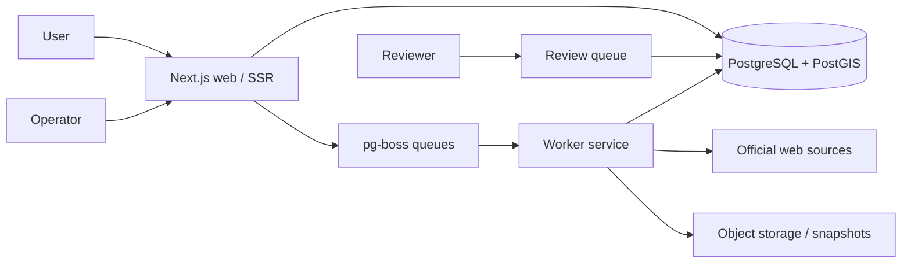

# Production Architecture

## Trust boundary

The web app reads public records only from PostgreSQL where `buildings.status = published`. A deferred database trigger requires geocode, neighborhood, floors, successful verified leasing link, and reviewed provenance for minimum publication fields. Extraction jobs and workers cannot publish directly.

## Service ownership

- **Web:** SSR public discovery, submission intake, authenticated operations.
- **Database:** canonical catalog, PostGIS geography, provenance, review workflow, audit.
- **Worker:** queue-driven, retryable pipeline stages. M1 establishes contracts and health; crawling/extraction belongs to M3.
- **Identity:** Auth.js database sessions, email/GitHub identity, roles, encrypted TOTP MFA.

## Scaling posture

Spatial GiST indexes, market/status indexes, queue indexes, and normalized asset/source tables are designed for 50k buildings and 500k assets without changing the ownership model.
