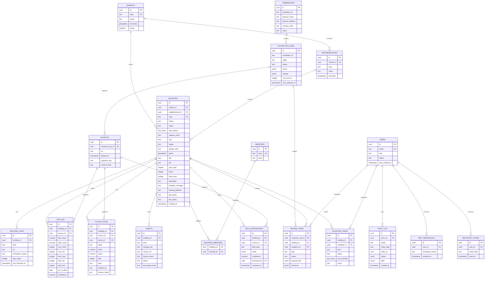

# PropertyVault ERD

This ERD is the approved Milestone 1 migration contract. Authentication support tables used internally by Auth.js are omitted for clarity; the domain `users` table remains canonical for roles and MFA state.

